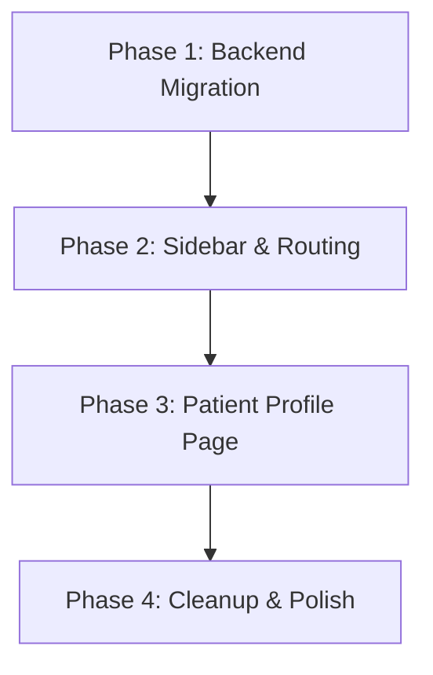

# Role-Based System Redesign — Implementation Plan

## Overview

Restructure the DentralFlow application into **two distinct account experiences**:

| Account | Sidebar Modules |
|---|---|
| **Receptionist** | Dashboard · Appointments · Patients · Payments · Settings |
| **Admin / Doctor** (merged) | Dashboard · Treatment Plans & Sessions · Doctors · Warehouse · Patients (profile view) · Settings |

Additionally, **merge the standalone Attachments module into the Patient Profile** — a new comprehensive single-page view available to Admin/Doctor that consolidates patient demographics, attachments, appointments, treatments, and payment history.

---

## Phase 1 — Backend: Add `patientId` to Attachments

> [!IMPORTANT]
> The current `Attachment` model only has `doctorId`. To associate files with patients (X-Rays, prescriptions, etc.), we need a `patientId` foreign key.

### 1.1 Prisma Schema Migration

Update `backend/prisma/schema.prisma`:

```diff
 model Attachment {
   id        String         @id @default(uuid())
   doctorId  String
+  patientId String?
   fileName  String
   filePath  String
   fileType  AttachmentType
   notes     String?
   ...

   doctor Doctor @relation(fields: [doctorId], references: [id])
+  patient Patient? @relation(fields: [patientId], references: [id])

+  @@index([patientId])
 }

 model Patient {
   ...
+  attachments Attachment[]
 }
```

Then run: `npx prisma migrate dev --name add_patient_to_attachment`

### 1.2 Backend Attachments Module Updates

- **Validator**: Add optional `patientId` to create & query schemas
- **Repository**: Support `patientId` filter in `findManyAndCount`, include `patient` in responses
- **Service**: Accept `patientId` in `createAttachment`, validate patient exists
- **DTO**: Include `patient` info in response

### 1.3 New API: `GET /patients/:id/profile`

A new backend endpoint that aggregates all patient data in a single response:

```js
// Returns: patient info + attachments + appointments + treatments + payments + examinations
GET /api/v1/patients/:id/profile
```

This avoids multiple API calls from the frontend profile page.

---

## Phase 2 — Frontend: Role-Based Sidebar & Routing

### 2.1 Sidebar Restructure ([Sidebar.tsx](file:///home/youssef/Dental-Management-System/frontend/src/components/layout/Sidebar.tsx))

Replace the current flat `navItems` array with role-segmented navigation:

```ts
const receptionistNav = [
  { name: 'Dashboard', path: '/dashboard', icon: LayoutDashboard },
  { name: 'Appointments', path: '/appointments', icon: Calendar },
  { name: 'Patients', path: '/patients', icon: Users },
  { name: 'Payments', path: '/payments', icon: CreditCard },
  { name: 'Settings', path: '/settings', icon: Settings },
];

const adminDoctorNav = [
  { name: 'Dashboard', path: '/dashboard', icon: LayoutDashboard },
  { name: 'Treatment Plans', path: '/treatment-plans', icon: TrendingUp },
  { name: 'Treatment Sessions', path: '/treatments', icon: Activity },
  { name: 'Patients', path: '/patients', icon: Users },
  { name: 'Doctors', path: '/doctors', icon: Stethoscope },
  { name: 'Warehouse', path: '/warehouse', icon: Archive },
  { name: 'Settings', path: '/settings', icon: Settings },
];
```

### 2.2 Router Update ([routes/index.tsx](file:///home/youssef/Dental-Management-System/frontend/src/routes/index.tsx))

- Add new route: `/patients/:id` → `<PatientProfilePage />`
- Remove standalone `/attachments` route
- Remove `/examinations` and `/reports` from visible navigation (keep routes for backward compat or remove entirely)

### 2.3 Route Guards

Add a `<RoleGuard>` wrapper component that redirects users who try to access routes outside their permission scope.

---

## Phase 3 — Frontend: Patient Profile Page (Doctor View)

> [!TIP]
> This is the crown jewel — a unified patient profile that replaces the need for doctors to jump between Attachments, Appointments, and Treatments modules to understand a patient's history.

### 3.1 New Feature: `features/patients/PatientProfilePage.tsx`

A tabbed single-page profile view with these sections:

| Tab | Content |
|---|---|
| **Overview** | Demographics, contact info, blood group, allergies, medical history, notes, balance |
| **Appointments** | Full appointment history with status badges, filterable by date range |
| **Treatment Plans** | All treatment plans with status, estimated cost, linked sessions |
| **Treatments** | Individual treatment session log with tooth numbers, procedures, prices |
| **Attachments** | X-Rays, prescriptions, images — with upload, download, preview, and delete |
| **Payments** | Payment ledger with invoice numbers, amounts, methods |

### 3.2 Data Fetching Strategy

Use the new `GET /patients/:id/profile` endpoint with TanStack Query:

```ts
const { data: profile } = useQuery({
  queryKey: ['patient-profile', patientId],
  queryFn: () => getPatientProfile(patientId),
});
```

### 3.3 Attachment Integration

The Attachments tab within the profile will:
- List attachments filtered by `patientId`
- Allow Admin/Doctor to upload new files (with `patientId` auto-populated)
- Support inline image preview for X-Rays and Images
- Provide download functionality for all file types

---

## Phase 4 — Cleanup & Polish

### 4.1 Remove Standalone Attachments Page
- Delete `/attachments` route from router
- Remove `Attachments` from sidebar navigation
- Keep `features/attachments/` API layer (reused by patient profile)

### 4.2 Dashboard Differentiation
- **Receptionist Dashboard**: Today's appointments, recent patients, quick actions (New Patient, Book Appointment, Create Invoice)
- **Admin/Doctor Dashboard**: Treatment stats, revenue overview, low stock alerts, upcoming patient sessions

### 4.3 Build Verification
- Run `npm run build:frontend` to verify TypeScript compilation
- Run `npm run test:backend` to verify all backend tests pass after migration

---

## Execution Order



| Step | Files Modified | Estimated Changes |
|---|---|---|
| 1.1 | `schema.prisma` | Add `patientId` to Attachment |
| 1.2 | `attachments.*.js` (validator, repo, service, dto) | Support patient filtering |
| 1.3 | `patients.routes.js`, new `patients.service.js` method | New `/profile` endpoint |
| 2.1 | `Sidebar.tsx` | Role-based nav arrays |
| 2.2 | `routes/index.tsx` | Add profile route, remove attachments |
| 2.3 | New `RoleGuard.tsx` | Route permission component |
| 3.1 | New `PatientProfilePage.tsx` | Full profile UI (~600 lines) |
| 3.2 | `patients/api.ts`, `patients/types.ts` | Profile endpoint + types |
| 4.1 | Remove attachments from nav | Cleanup |
| 4.2 | `DashboardPage.tsx` | Role-aware dashboard |

---

> [!NOTE]
> **Decision needed**: Should the Receptionist Patients page remain as-is (list + modal view), while the Admin/Doctor gets the full profile page with route navigation (`/patients/:id`)? Or should both roles see the profile page with different permission levels?
